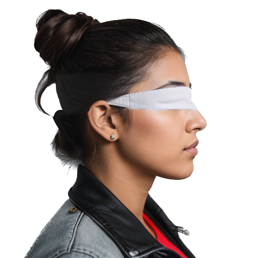

# 🏛️ Symposium Poster Guide: Gaze-as-Force & Social Threat

This document serves as the final blueprint for the symposium poster, integrating methodology text, statistical findings, and the corresponding visual assets.

---

## 🛠️ Section 1: METHODS

### Overview

* **Platform:** Amazon Mechanical Turk (AMT).
* **Task:** Online physics-based tube-tipping task. Participants viewed an introductory demonstration tutorial on how to tilt a tube to its tipping point.
* **Timing:** Each trial is limited to a few seconds to discourage overthinking—intentionally capturing fast intuitions and implicit effects.
* **Design:** 32 trials total.
  * **Variables:** Tube type (short, tall, wide, slim), Tipping direction (left vs. right), Face placement (left vs. right), and Facial threat (low vs. high).

> [!NOTE]
> **Task Diagram:** Use `task_diagram.png` here to illustrate the mechanics of the tipping judgment.

---

### Experiment 1: Reproduction

Testing sighted vs. blindfolded gaze effect perception and judgment.

* **Goal:** Replicate the "Gaze-as-Force" effect where sighted gaze biases the perceived physical stability of an object.
* **Statistics:** One-sample t-test of each participant’s "D" (bias) against 0.

| Condition | Visual Asset |
| :--- | :--- |
| **Sighted** |  `images/ID008.png` |
| **Blindfolded** |  `images/ID008_blindfold.png` |

---

### Experiment 2: New Hypothesis (Social Threat)

Testing if social threat amplifies the physical intuition of gaze.

* **Stimuli:** AI-generated faces independently rated for perceived threat on a 1–5 Likert scale.
* **Comparison:** Low perceived threat (Face ID 015) vs. High perceived threat (Face ID 017).

| Identity | Threat Level | Visual Asset |
| :--- | :--- | :--- |
| **Meek** | Low (1.78) |  `images/ID015.png` |
| **Threatening** | High (4.43) |  `images/ID017.png` |

---

### Data Cleaning & Integrity

Raw JSON data was filtered to remove repeat subjects and behavioral bots.

* **Filters:** $3^\circ < \text{tilt-angle} < 40^\circ$.
* **Requirements:** Must have valid "towards" and "away" trials that can be paired up.

> [!TIP]
> **Robustness Check:** Include `sensitivity_exp1.png` and `sensitivity_exp2.png` as small callouts to show that results hold across all filter ranges.

---

## 📊 Section 2: FINDINGS

### Main Replication (Exp 1)

Results were consistent with original published findings.

* **Eyes Open:** Significant bias ($N=578, D=+0.237^\circ, SE=0.114, p=0.039$).
* **Eyes Covered:** No significant bias ($N=578, D=+0.011^\circ, SE=0.113, p=0.921$).

> [!IMPORTANT]
> **Primary Graph:** Use `figure_d_bars.png` to anchor this section. It clearly shows the gap between sighted and blindfolded conditions.

---

### Threat Manipulation (Exp 2)

Unpaired between-subject tests on full per-face samples were not significant for either identity.

**Unpaired (Between-Subject):**

* **Meek (ID 015):** $N=256, D=+0.034^\circ, SE=0.169, p=0.834$
* **Threatening (ID 017):** $N=234, D=+0.157^\circ, SE=0.205, p=0.447$

**Paired (Within-Subject):**
Analysis focused on $N=249$ subjects who had usable data for *both* identities.

* **Meek (ID 015):** $D=+0.088^\circ, SE=0.200, p=0.657$
* **Threatening (ID 017):** $D=+0.114^\circ, SE=0.201, p=0.574$
* **Direct Contrast (T-M):** Mean diff $= +0.150^\circ, SE=0.270, p=0.580$.

> [!NOTE]
> **Detailed Analysis Graph:** Use `within_subject_exp2.png` here. It visualizes the individual difference distributions and confirms that threat did not significantly scale the bias.
>
> **Alternative (Full Sample):** You can also use `between_subject_exp2.png` to show the unpaired individual distributions for the largest possible sample size ($N=332$ and $N=208$).

---

### Final Research Note

The reduction from $N=256/234$ to $N=249$ reflects the removal of subjects lacking paired data after standard filtering. These subjects were removed to ensure exact comparisons between threat conditions.

**Statistical Standards:**

* All tests are two-tailed.
* Error bars denote Standard Error of the Mean (SEM).

---

## 🚀 Section 3: CONCLUSION & NEXT STEPS

### Summary of Findings

Our results reinforce the robustness of the gaze-force illusion while tempering hypotheses that perceived social threat simply scales its intensity. While the core effect reliably dissociates based on gaze visibility, the categorical manipulation of threat level via identity failed to produce a statistically supported escalation of the bias. This suggests that the implicit physical intuition of gaze-as-force may be less sensitive to static social attributes than previously theorized.

### Proposed Next Steps

* **Systematic Cutoff Sweep**: Explore how shifting the angle filters ($3^\circ$–$40^\circ$) impacts the detection of threat-scaling.
* **High-Intensity Social Cues**: Replace static identifiers with aggressive/threatening facial expressions to provide a more potent manipulation.
* **Vulnerability Context**: Test if the threat effect only emerges when the physical object is in a more precarious state (e.g., taller or slimmer tubes).
* **Per-Subject Predictive Modeling**: Use individual participant ratings of the faces as continuous regressors to account for subjective differences in threat perception.
